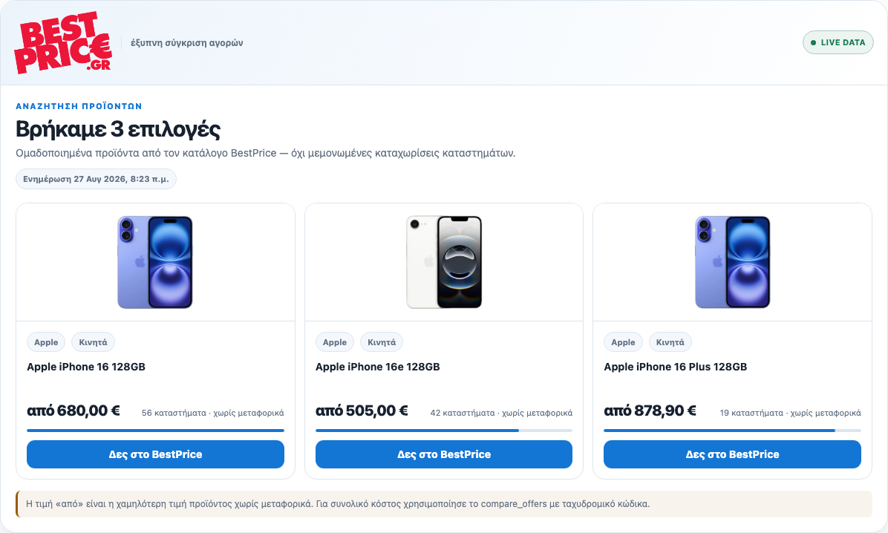
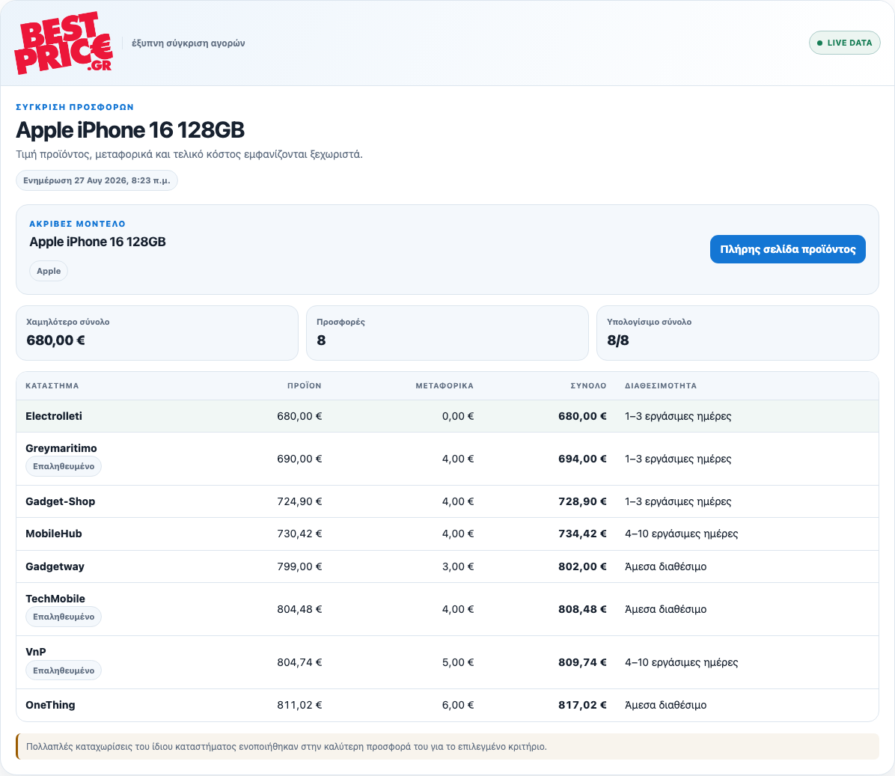
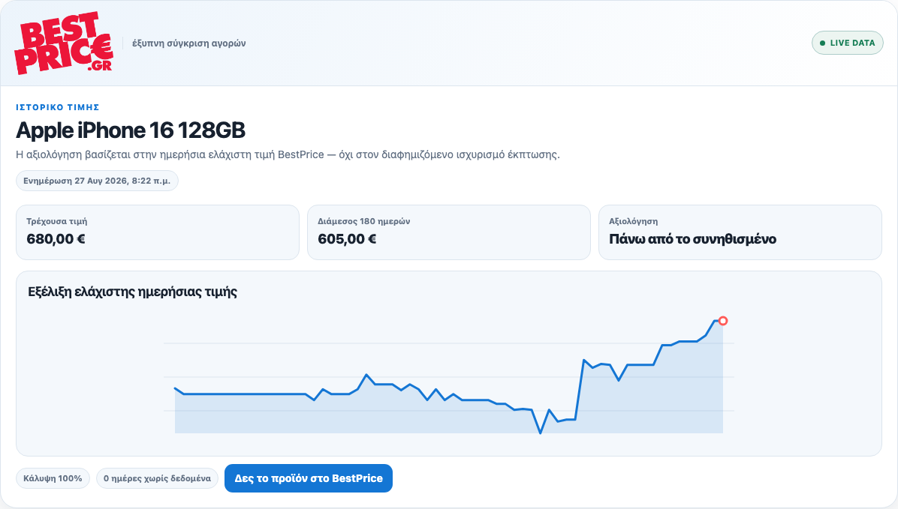

# BestPrice MCP

[](https://github.com/TheBestCo/bestprice-mcp/actions/workflows/test.yml)
[](https://glama.ai/mcp/servers/TheBestCo/bestprice-mcp)
[](LICENSE)

The official [Model Context Protocol](https://modelcontextprotocol.io/) server for
[BestPrice.gr](https://www.bestprice.gr/), Greece's price-comparison service. It gives AI
assistants read-only access to shopping decisions, live product search, offer comparison,
and price history. No account or API key is needed.


```text
https://mcp.bestprice.gr/mcp
```

- Transport: Streamable HTTP over HTTPS, no authentication
- Official Registry ID: `gr.bestprice/mcp`
- Server version: `1.8.0`
- Public guide: <https://www.bestprice.gr/mcp>
- Support: <https://www.bestprice.gr/contact>

This repository holds everything that lives outside the hosted service: the install
manifests for each AI client, a local stdio bridge for hosts that cannot speak HTTP, and
the browser-native WebMCP layer. The server itself is not in this repository.

## Tools

| Tool | What it does | Key arguments |
| --- | --- | --- |
| `get_shopping_decision` | Runs the BestPrice Shopping Brain: an evidence-backed recommendation, need-based comparison, or read-only basket plan with reasons, tradeoffs, and unknowns. | Natural-language need, optional budget and five-digit Greek postcode |
| `search_products` | Finds canonical products in the catalog. Returns product IDs and the catalog minimum price before shipping. | `query`, optional `limit` |
| `compare_offers` | Compares current merchant offers for one exact product, separating item price, shipping, and delivered total. | `product_id` from a previous result, optional `postal_code` |
| `get_price_history` | Summarises how a product's price moved over time. | `product_id`, `days` |

All four tools are read-only. They never place orders, create alerts, or read account
data. Results link to a BestPrice product page, never directly to a merchant. Unknown
shipping is reported as unknown, not as free. Search covers safe physical products;
digital goods, services, and age-restricted categories are excluded.

## Quick start

Every client below connects to the same endpoint. Detailed, provider-specific
instructions including OpenAI, Grok, GitHub Copilot, and Microsoft Copilot Studio are in
[`docs/provider-setup.md`](docs/provider-setup.md).

### Claude

[Connect BestPrice to Claude](https://claude.ai/customize/connectors?modal=add-custom-connector&connectorName=BestPrice&connectorUrl=https%3A%2F%2Fmcp.bestprice.gr%2Fmcp)
opens the custom-connector flow with the endpoint prefilled. For Claude Code:

```sh
claude mcp add --transport http bestprice-shopping https://mcp.bestprice.gr/mcp
```

The bundled [`.mcp.json`](.mcp.json) is the equivalent project-scoped configuration.

### Cursor

[Add BestPrice Shopping to Cursor](https://cursor.com/install-mcp?name=bestprice-shopping&config=eyJ1cmwiOiJodHRwczovL21jcC5iZXN0cHJpY2UuZ3IvbWNwIn0%3D)
shows the decoded configuration before adding it. The [`.cursor-plugin/`](.cursor-plugin/)
directory holds the marketplace plugin and an agent skill.

### VS Code

[Add BestPrice Shopping to VS Code](vscode:mcp/install?%7B%22name%22%3A%22bestprice-shopping%22%2C%22type%22%3A%22http%22%2C%22url%22%3A%22https%3A%2F%2Fmcp.bestprice.gr%2Fmcp%22%7D)

### Gemini CLI and Qwen Code

```sh
gemini extensions install https://github.com/TheBestCo/bestprice-mcp
qwen extensions install https://github.com/TheBestCo/bestprice-mcp --consent
```

Both extensions restrict the imported tools to the four listed above.

### Codex and other Agent Plugin hosts

The root [`plugin.json`](plugin.json) and [`mcp.json`](mcp.json) follow the
[Agent Plugins 1.0 specification](https://agent-plugins.org/specification);
[`.codex-plugin/`](.codex-plugin/) carries the Codex-specific manifest.

### Gemini API, DeepSeek, Z.ai

Runnable examples live in [`examples/`](examples/): the Gemini Interactions API and Genkit,
a DeepSeek Harness plugin entry, and a Z.ai GLM call. Each needs the provider's own API key.
BestPrice needs none.

### Any other MCP client

Add a Streamable HTTP server at `https://mcp.bestprice.gr/mcp`. If the host only supports
stdio servers, use the bridge in this repository:

```sh
git clone https://github.com/TheBestCo/bestprice-mcp.git && cd bestprice-mcp
npm ci
node stdio.mjs
```

The bridge forwards everything to the public endpoint and accepts two environment
variables: `BESTPRICE_MCP_URL` (default: the public endpoint) and
`BESTPRICE_MCP_TIMEOUT_MS` (default: 60000). A `Dockerfile` builds the same bridge for
[Glama](https://glama.ai/mcp/servers/TheBestCo/bestprice-mcp) and similar hosts.

## A safe first conversation

1. Ask for a decision: `Θέλω κινητό έως 500 ευρώ με NFC και 5G υποχρεωτικά.`
   (I want a phone up to 500 euros, NFC and 5G required.)
2. Or search: `Find Sony WH-1000XM5 under 300 euros.`
3. Pass a returned `product_id` to `compare_offers` with postal code `10558`.
4. Pass the same `product_id` to `get_price_history` for 180 days.

Queries work in Greek or English. Catalog data and merchant names come back in Greek.

| Search | Compare offers | Price history |
| --- | --- | --- |
|  |  |  |

## Browser-native WebMCP

BestPrice pages also register contextual WebMCP tools in compatible browsers: 13 live today, 14 in
this source, covering the visible search, filter, sort, product, offer, specification, price-history,
and one visible-offer action while leaving the merchant choice to the shopper. The contracts,
fail-closed runtime, deterministic evaluator, and the 47-case natural-language dataset are in
[`webmcp/`](webmcp/).

## Discovery

- [Official MCP Registry](https://registry.modelcontextprotocol.io/v0.1/servers?search=gr.bestprice%2Fmcp)
- Agent discovery: [`ard.json`](https://www.bestprice.gr/.well-known/ard.json),
  [`webmcp.json`](https://www.bestprice.gr/.well-known/webmcp.json),
  [server card](https://mcp.bestprice.gr/mcp/server-card)
- Community indexes: [Glama](https://glama.ai/mcp/servers/TheBestCo/bestprice-mcp),
  [WebMCP Registry](https://webmcp-registry.dev/domain/www.bestprice.gr),
  [webmcp.com](https://webmcp.com/sites/bestprice.gr),
  [cursor.directory](https://cursor.directory/plugins/bestprice-shopping)

## Development

```sh
npm ci
npm run check   # Biome lint and format
npm test        # node --test: bridge, WebMCP, manifests, dataset
```

Tests need no network: the bridge is exercised against an in-process fake remote. Node 20
or newer is required; `.nvmrc` pins 22.

## Versioning

Two versions appear in this repository on purpose:

- **Package version** in `package.json` and every plugin or extension manifest. It changes
  when this repository's manifests, bridge, or WebMCP layer change, and is tagged `vX.Y.Z`.
- **Server version** in `server.json` and the line near the top of this README. It is the
  version the hosted service reports and is published to the official MCP Registry.

`CHANGELOG.md` tracks the package version.

Timestamped hosted-service checks are recorded separately. The
[7 September Shopping Brain v12 verification](docs/releases/2026-09-07-brain-v12.md)
includes its exact gateway revision, sanitized canary results, and scope limits.

## Security

Report vulnerabilities privately as described in [`SECURITY.md`](SECURITY.md).

## Contributing

See [`CONTRIBUTING.md`](CONTRIBUTING.md). Issues and pull requests are welcome.

## License

Apache License 2.0. Copyright The Best Company S.A. See [`LICENSE`](LICENSE).

Privacy: <https://www.bestprice.gr/policies/privacy> · Terms: <https://www.bestprice.gr/policies/terms>
